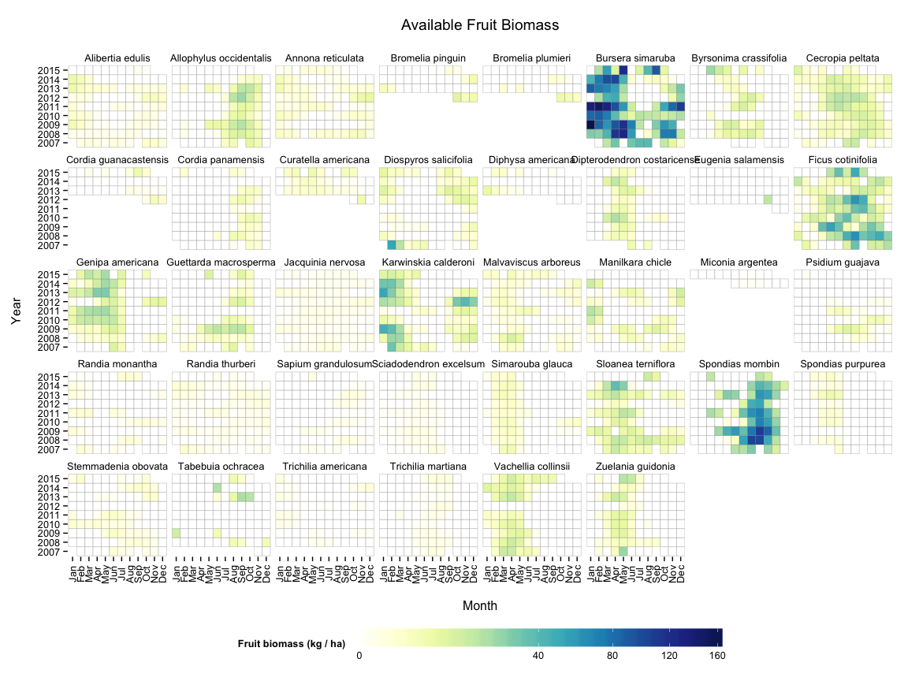
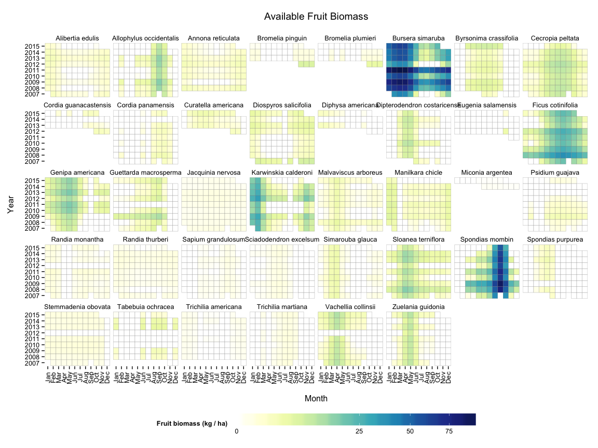
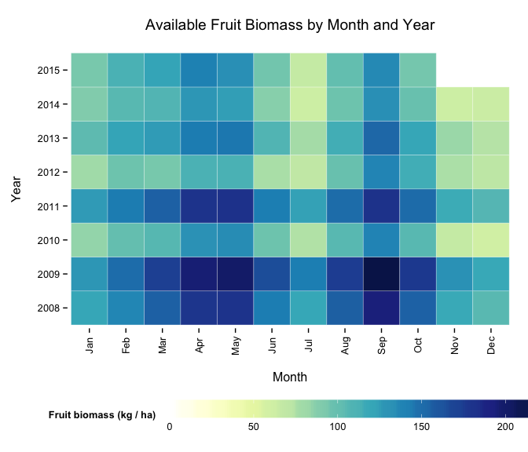
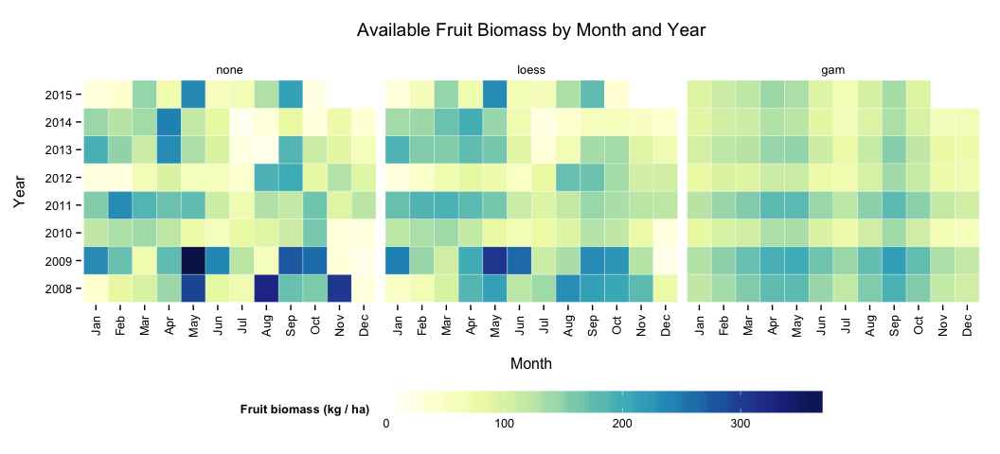

Fruit Biomass Calculations for Santa Rosa
=========================================

The fruit biomass calculations are based on three primary data sets:

1.  Phenology data is used to determine when and to what degree ripe fruit is available for each food tree species.
2.  Transect data is used to determine the abundance of each food tree species.
3.  FPV data is used to determine which trees in the transect data are capable of bearing fruit and feeding monkeys.

The first two data sets can be pulled directly from the PACE database. The FPV data is not (yet) in the database, so it has to be loaded from a CSV file. Ask [Fernando](mailto:facampos@ucalgary.ca) for this file if you don't already have it.

First Steps
-----------

Before doing anything, you must install the `paceR` package for R and set up your connections to the PACE database. There are instructions for doing this [here](README.md). This is the largest hurdle and **nothing else will work until this is done correctly!**

Then you can load the required packages:

``` r
  library(paceR)
  load_pace_packages()
```

and create connections to the "monkey" and "paceR" databases.

Then we can get the required data:

``` r
# Use special phenology query
ph <- getv_Phenology(paceR_db)
# No special transect query, so just get raw table
tr <- get_pace_tbl(paceR_db, "vVegetationTransect")
# Read in FPV file (not currently in PACE!)
fpv <- tbl_df(read.csv("data/AllFPV.csv"))

# Create set of species to exclude
exclude_species <- c("SCAP", "SPAV", "CCAN", "BUNG", "HCOU",
                    "ATIB", "GULM", "LCAN", "LSPE", "FUNK")
```

Calculations
------------

The easiest way to calculate monthly fruit biomass for Santa Rosa is to use the convenient function `get_biomass_sr()`. This is basically a "wrapper" around a longer script that calls different functions one-by-one. These task-specific functions are also available to be used, but they're not explained here. The advantage to using `get_biomass_sr` is that it's very easy. The advantage to using the lower-level functions is that they provide access to other useful information.

This package implements three different methods for calculating fruit biomass. The method is controlled by the parameter called "smooth" that is supplied to the `get_biomass_sr` function.

### No Smoothing

When the function is called with `smooth = "none"`, the raw availability indices are averaged for each species in each month and these values are used to calculate biomass for each species.

``` r
biomass_avail_raw <- get_biomass_sr(ph, tr, fpv, exclude_species, smooth = "none")
```

We can look at some of the values...

``` r
biomass_avail_raw %>% select(SpeciesName, year_of, month_of, biomass_monthly_kg)
#> Source: local data frame [3,398 x 4]
#> Groups: SpeciesName, year_of [301]
#> 
#>         SpeciesName year_of month_of biomass_monthly_kg
#>               (chr)  (fctr)   (fctr)              (dbl)
#> 1  Alibertia edulis    2007      Feb          0.0000000
#> 2  Alibertia edulis    2007      Mar          2.5059181
#> 3  Alibertia edulis    2007      Apr          0.0000000
#> 4  Alibertia edulis    2007      May          0.0000000
#> 5  Alibertia edulis    2007      Jun          0.8949708
#> 6  Alibertia edulis    2007      Jul          0.8949708
#> 7  Alibertia edulis    2007      Aug          0.0000000
#> 8  Alibertia edulis    2007      Oct          0.6712281
#> 9  Alibertia edulis    2007      Nov          4.9223392
#> 10 Alibertia edulis    2007      Dec          0.0000000
#> ..              ...     ...      ...                ...
```

The function `plot_biomass_species` visualizes this using a heatmap.

``` r
plot_biomass_species(biomass_avail_raw)
```


Summarise the data by adding up all species in each month.

``` r
b_summary_raw <- biomass_monthly_summary(biomass_avail_raw)
```

Now plot the summary.

``` r
plot_biomass_monthly(b_summary_raw)
```


### Loess Smoothing

When the function is called with `smooth = "loess"`, the raw availability indices are smoothed using [Local Polynomial Regression Fitting](https://stat.ethz.ch/R-manual/R-patched/library/stats/html/loess.html). The loess smoother is applied to each species and year separately, which allows the seasonal pattern of fruiting for a given species to differ from year to year.

Let's carry out the same steps with this method. First for each species.

``` r
biomass_avail_lo <- get_biomass_sr(ph, tr, fpv, exclude_species, smooth = "loess")
plot_biomass_species(biomass_avail_lo)
```



And then the summary. This smoothing method produces an overall pattern similar to the raw scores, but its main effects are 1) dampening/devaluing extreme values and outliers, and 2) allowing availability scores in adjacent months to have some influence on each other.

``` r
b_summary_lo <- biomass_monthly_summary(biomass_avail_lo)
plot_biomass_monthly(b_summary_lo)
```


### GAMM Smoothing

When the function is called with `smooth = "gam"`, the raw availability indices are smoothed using [Generalized Additive Mixed Models](https://stat.ethz.ch/R-manual/R-devel/library/mgcv/html/gamm.html). This is applied to each species separately. This smoothing method assumes that *the month-to-month fruiting pattern for a given species is the same from year to year*; what differs is the degree to which that species' cycle is expressed in any particular year. This assumption is probably bad for some species (like *Ficus*), but it's probably true for most species.

Let's carry out the same steps with this method. First for each species.

``` r
biomass_avail_gam <- get_biomass_sr(ph, tr, fpv, exclude_species, smooth = "gam")
plot_biomass_species(biomass_avail_gam)
```



And then the summary. This produces an overall pattern that is approximately the same across years as far as the *timing* of fruit abundance peaks and troughs for each species. The pattern differs quite a bit from the others. I think the main strengths of this method are that it's easy to identify variation around the "typical" conditions, e.g., which months tend to have higher or lower fruit abundance, and which years are relatively good or bad.

``` r
b_summary_gam <- biomass_monthly_summary(biomass_avail_gam)
plot_biomass_monthly(b_summary_gam)
```



### Comparison

Finally, we can make a side-by-side plot of the three methods

``` r
# Side by side plot
b_summary_raw$method <- "none"
b_summary_gam$method <- "gam"
b_summary_lo$method <- "loess"
temp <- bind_rows(b_summary_raw, b_summary_lo, b_summary_gam)
temp$method <- factor(temp$method, levels = c("none", "loess", "gam"))
plot_biomass_monthly(temp) + facet_wrap(~method)
```


